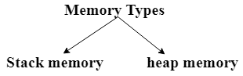
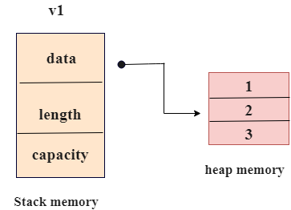
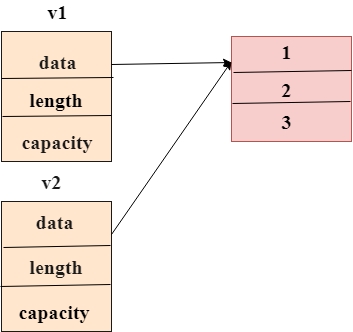
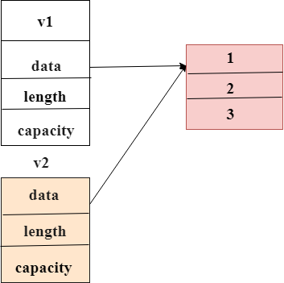

# learn-rust  

## Book
- https://rust-lang.github.io/rustc-guide/about-this-guide.html rust官方指南
- http://wiki.jikexueyuan.com/project/rust-primer/quickstart/primitive-type.html  极客学院的rust教程
- https://doc.rust-lang.org/std/primitive.f64.html rust 函数库
- https://doc.rust-lang.org/rust-by-example/index.html rust example
- https://rust-lang.github.io/rfcs/ rust rfcs
- https://kaisery.gitbooks.io/trpl-zh-cn/content/ 《Rust 程序设计语言》 中文版
- https://rustwasm.github.io/book/ 《Rust 程序设计语言》 英文版
- https://doc.rust-lang.org/stable/rust-by-example/ 通过例子来学习rust
- https://crates.io/ rust 依赖包
- TODO https://kaisery.github.io/trpl-zh-cn/ch02-00-guessing-game-tutorial.html 猜猜看游戏 
- https://rustwiki.org/zh-CN/rust-by-example/std/result.html 中文，例子学习
## 错误
- ^^^ `std::result::Result<_, _>` cannot be formatted with the default formatter
- //#[derive(Debug)]的//去掉时能自动为Student实现std::fmt::Debug特性。
- only valid in field-less enums
- `Employee` cannot be formatted with the default formatter

## 疑问

### 1. 如何if == string？

### 2. while循环和for循环的区别：

> 如果数组的索引长度在运行时增加，那么while循环显示错误，但在for循环的情况下不会发生这种情况。 因此，可以说for循环增加了代码的安全性并消除了错误的可能性。

### 3. 为什么要加!

### 4. 使用前，需要将变量声明，不存在js类似的变量提升

### 5. i32表示多少 
### 6. 不能打印长元组？？ 报错,WHY?
```rust
fn main(){
   let too_long_tuple=(1,65,56,6,565,65,95,5,655,656,64,65,5,61,6,5656);
   println!("too long tuple:{:?}",too_long_tuple);
}
```
### 7. rust 如何执行一段函数返回的代码，即函数返回值
```rust

/*
* @pair 入参一个，内含两个元素，数据类型为(i32，bool)元组
* @return 返回值为 数据类型为，也是个元组 (bool,i32)
*/
fn reverse(pair:(i32,bool))->(bool,i32){
	let (integer,boolean)=pair;
	(boolean,integer)
}
fn main(){
	let pair = (11,true);
	println!("{:?}",reverse(pair));	
}

```

### 8. rust 如何计算一个函数加值的运算，涉及到 ：入参、返回值，类型

```rust
fn main(){
	println!("{}",fool(999));
}
fn fool(num:i32)->(i32){
	return num+999; // 或者num+999，不需要return
}

```

### 9. 为什么要加一个&?

答案：表示引用

```rust
use std::mem;
fn analyze_slice(slice:&[i32]){
	println!("第一个元素：{}",slice[0]);
	println!("数组的长度：{}",slice.len());
}

fn main(){
	let xs:[i32;5]=[9898,9856,685659,66,9];
	analyze_slice(&xs)//为什么要加一个&呢？	
}
```


### 10. match在函数中的作用
	- match 由分支(arms)构成，一个分支包含一个模式(pattern)
	- match的cmp方法会返回`Ordering:Greater`,`Ordering:Less`,`Ordering:Equal`
```rust
fn inspect(event:WebEvent){
    // match干嘛的？
    match event {
        WebEvent::PageLoad=>println!("page load"),
        WebEvent::PageUnload=>println!("page unload"),
        WebEvent::Keypress(c)=>println!("pressed '{}'.",c),
        WebEvent::Paste(s)=>println!("pasted\"{}\".",s),
        WebEvent::Click {x,y}=>println!("click at x={},y={}",x,y)
    }
}
```

### 11. 怎么打印枚举
```rust
enum Point{
	x = 111
}
println!("{}");

```

### 12. return 部分返回的尖括号？

### 13. Ok(())是什么意义？

	- Result 风格，大写Ok,因为它是一个枚举enum

	- future中，使用小写ok方法【首选】
	
### 14. 函数括号加问号？

### 15. 怎么查看type 类型？

### 16. String 转为真正的数字类型
```text
let num:u32=guess.trim().parse().expect('xxx')

```

### 17. 如何取到键盘输入的值
> io::stdin().read_line(&mut xx).expect("错误~~") ，存到一个变量

### 18. TODO 如何迭代/循环元组？
```rust
fn main(){
let long_tuple =(
        1u8,2u16,3u32,4u64,
        -1i8,-2i16,-3i32,-4i64,
        0.1f32,0.2f64,'a',true);
}
```
### 19.TODO，比如test()`?` 这个后面的问号是干嘛的？


### 20. 问号是干嘛的？fs::write("foo.txt","哈哈哈")?;

### 21. 数字转字符串

## structures 结构


rust 通过自定义类型主要通过以下两个关键形成：
- struct 声明一个结构
- enum   声明一个枚举

常量可以通过`const` `static`  关键字声明

	- const x = 99; 不合适。x推荐大写
	- const X=8;错误，X虽然大写，但需要声明数据类型
	- const X:u32=999 √
	- const mut X:u32=99  常量不接受可变量修饰符

结构：
- 元组结构，基本上是命名为元组的。
- 经典的C结构
- 无字段的单元结构对于泛型很有用


- rust 的结构和解构
```rust
struct Pair(i32,f32);
struct Person<'a> {
    name: &'a str,
    //这是啥子？
    age: u8,
}
 fn main(){
 	  let pair =Pair(99,99.9);
 	  let Pair{x,y}=pair; //todo ??
 	  println!("{:?}\n{:?}",x,y);
 	  
 	   let name = "Jogel";
      let age = 27;
      let jogel = Person { name, age };
      
      println!("{:?}",jogel);
 }
```    

- 如何跨文件使用use    
```rust

enum Status{
    Rich,
    Poor
}
enum Work{
    Google,
    Microsoft,
}

use Status::{Poor,Rich};

use Work::*;

```

## 定时器

```rust
use std::thread;
use std::time::Duration;

fn main() {
    let mut x = 1;
    while x < 10 {
        println!("{},{}",x,"哈哈哈哈");
        x += 1;
        thread::sleep(Duration::from_millis(1000));
    }
    println!("{},{}",x,"哦哦哦");
}

```
## 内存和分配

;

- 堆栈存储器
	- 循环放置
	- 相反顺序移除
	- 遵从`后进先出`，进电梯 原则
	- 始终 首先删除最后插入的数据
	- `堆栈内存`有组织的内存，比`堆内存`更快
	- 访问内存的方式
	- 编译时数据大小未知，则`堆内存`用于存储内容

- 堆内存
	- `堆内存`是有组织的内存	
	- os 在`堆内存`中找到一个空的空格并返回一个指针，这叫 `在对上分配`

;

- 第一步
	- 向量v1与值 1 2 3 '666'绑定，四个部分组成
	- 指向存储器中指向存储在内存的数据的指针 长度和向量的容量
	- 这部分存储在堆栈中，二数据存储在堆内存中

;

- 第二步
	- `v1` 向量分配给向量`v2`
	- 指针，长度、容量将复制到堆栈中
	- 但不会讲数据复制到堆内存中 
	- 
	- `v1`、`v2` 都超出范围时，两者都会尝试释放内存
	- 这会导致双重空闲内存，从而使得内存损坏~
	
;

- 第三步
	- rust 避免了第二步的内存问题
	- rust没有复制分配的内存，则认为`v1`向量不再有效
	- 当 `v1`超出范围时，它不需要释放`v1`的内存
	
;

```rust
fn main(){
	let v1= vec![1,2,3,"666"];
    let v2 = v2;
}

```

### 特征复制
- 复制特征是特殊的注释
- 放在存储堆栈上的整数类型上
- 如果类型使用了复制特征，则复制之后还可以使用旧变量
- 复制类型
	- 所有整数类型，如 `u32`
	- 布尔类型 `bool`:`true`, `false`
	- 所有浮动类型，如`f64`
	- 字符类型，如 `char`


### 所有权和函数

## 常识

|name|desc||
|---|---|---|
|.rs|rust文件后缀||
|Cargo.lock|||
|Cargo.toml|||
|xxx.iml|||
|src目录|源码||
|target目录|||
|mnt i| i是可以更改变量，可变变量||
|双引号|给字符/对象||
|str|String::from("a string")||
|char|`a`，单引号是一个单字符，超出则编译错误 `let char = 'a'`||
|&str|`abd`，双引号括住是多个字符 `let a="你好"`||
|return None|||
|return true|||
|return false|||
|return Err(err)|||
|impl|||
|符号整数|i开头||
|无符号整数|u开头，不是负号||
|#[derive(Debug)]|||
|#[allow(dead_code)]|||
|{:?}|打印数组、元组||
|match|rust关键字提供匹配模式，类似C的 `switch`|参考https://doc.rust-lang.org/rust-by-example/flow_control/match.html|
|_|下划线|_=>print!("xx"),类似如果下划线在match中，类似switch 的default:|
||||

### 定义/结论
- rust 变量默认不可改变，如需改变，则需要let mut bar="hello world"
- `let mut foo = String::new()` new 是String类型的关联函数，针对类型实现的，常称：静态方法
- `new` 创建类型实例的惯用函数名
- Result 类型是枚举，枚举(enums)，它的值被称为枚举的成员(variants):`ok`,`Err`。
	- ok 表示成功
	- Error 表示失败
- io::Result，的实例拥有expect方法,`return` 的是一个 输入的字节数`usize`
- rust标准库中尚未包含随机数功能，rust团队提供了 `rand` crate
- `std::cmp::Ordering`类型，`Ordering`也是一个枚举，成员是`Less`(小于),`Greater`(大于),`Equal`(等于),比较两个值的三种结果
- //#[derive(Debug)]的//去掉时能自动为Student实现std::fmt::Debug特性。
- use 枚举名称::*，自动列出枚举名称的名称，少写几次枚举名称,直接写成员
```text
	enum Work{
        Google,
        Microsoft,
        Alibaba=999
    }
   use Work::*;
   let work = Google;
   let worker =Microsoft;
   let taobao =Alibaba;//??

```
- rust 使用 snake case 风格，所有字母都小写并使用下划线分割
- rust 函数声明提升，无论声明在调用之前或之后
- rust 函数的参数必须有类型fn test(arg1:i32,arg2:u64)
- rust 是一门基于表达式的语言(expression-based)
- rust 无法使用`x=y=6`
### 常量和变量的区别

- let 变量
	- let x =6 不可变的变量
	- let mut x=6 自动推断类型，且可变
- const 常量，大写
	- const x = 99; 不合适。x推荐大写
	- const X=8;错误，X虽然大写，但需要声明数据类型
	- const mut X:u32=99  常量不接受可变量修饰符
	- const X:u32=999 √
	
	
### 隐藏,shadowing	

重复声明的方式来达到变量替换的目的，后者会替换前面的变量

```rust
fn main(){
	let mut x = 666;
	let x =999;
	let mut x = 888;//此处的mut 是多余了 
}

```

## install
### version
> rustc --version
### update 更新
> rustup update
### uninstall 下载
> rustup self uninstall

## demo
### 处理一次猜测
- [处理一次猜测](https://kaisery.github.io/trpl-zh-cn/ch02-00-guessing-game-tutorial.html)
```rust
use std::io;
fn main(){
    println!("hello world");
    let mut guess =String::new(); //?干嘛的，空字符串
    println!("请输入：{}",guess);

    io::stdin().read_line(&mut guess)
        .expect("读取行失败");
    println!("你猜的，{}",guess);
}

```
### 猜到对数字

```toml
[package]
name = "learn-rust"
version = "0.1.0"
authors = ["veaba"]
edition = "2018"

[dependencies]
rand="0.3.14"

```

```rust

/**
@desc 步骤分析：
    1、生成一个1-100的随机数
    2、键盘输入一值
    3、loop循环
    4、比较大小

*/
use std::io;
use rand::Rng;
use std::cmp::{Ordering,Ord};

fn main() {

    let code = rand::thread_rng().gen_range(1,101);
    println!("code:{}",code);


    loop {
        println!("======== 请输入你的字符 ========");
        let mut key=String::new();//生成一个类型为String的实例
        io::stdin().read_line(&mut key)
            .expect("输入错误~");
        println!("你输入的：{}",key);

        // rust 允许用一个新值来隐藏(shadow)guess之前的值：常用于转换值类型之类的场景，
        // 这种用法，允许复用guess便利店个名称，而不是创建两个不同的变量
        // 详见：https://kaisery.github.io/trpl-zh-cn/ch03-00-common-programming-concepts.html
        let key:u32=match key.trim().parse(){
            Ok(num)=>num,
            Err(_)=>{
                println!("字符类型不对");
                continue
            }
        };

        // key 和code 没办法对比,请改为CMP->cmp
        match key.CMP(&code) {
            Ordering::Less=>println!("太小了"),
            Ordering::Greater=>println!("太大了"),
            Ordering::Equal=>{
                println!("猜中了，biubiu");
                break;
            }
        }

    }

}


```

## rustup

## cargo

## 第一个程序

```rust
fn main(){
    print!("Hello,world!");
}
```


执行命令
> rustc hello.rs 

会生成` hello.exe`、`hello.pdb`，windows 下运行hello.exe才会运行

## 函数
|函数|解释|demo|
|---|---|---|
|format!()|格式化文本写入字符串||
|print!|类似format!，但打印到控制台||
|println!()类似print!但会添加新的一行|||
|eprint!|类型format!，打印为标准错误||
|eprintln!()类似eprint，但会添加新的一行|||
||||
||||
||||


```rust

// ->指返回
fn add_one(x:i32)->i32{
	x+1
}

// todo 问号是干嘛的？fs::write("foo.txt","哈哈哈")?;


// let _ = fs::write("foo.txt", "哈哈哈");

```

### 函数发散,不会返回


## 系统/全局函数或方法

### print!()  
- print!(双引号)，且只能是字符串

```rust
fn main(){
    let a=9;
    if  a==9 {
        print!("aaa");
    }
}
```

### println!()

```rust
println!("{}","xxx");
println!("{:?}",xxx);

```
### .to_owned()
### .iter()
### match  类似 `switch`
```rust
fn main(){
	let number=1;
    println!("the number:{}",number);
    // prime
    match number {
        1=>println!("One"),
        2=>println!("Two"),
        3|4|5|6|7|11=>println!("匹配的数字"),
        12...19=>println!("A ten哇"),
        // 不是特殊的
        _=>println!("default"),
    }
    let boolean =true;
    let binary =match boolean
        {
            false=>0,
            true=>1
        };
    println!("{}-{}",boolean,binary);
}

```


## if判断语句
```rust
fn main(){
    let a=9;
    if  a==8 {
        println!("aaa");
    }
    else if a>8 {
        println!("bbb");
    }
    else{
        println!("ccc");
    }
}
```
## if in a let语句

## 错误处理error
- https://doc.rust-lang.org/error-index.html#E0308  rust编译错误索引

> expected integer, found char

> too many characters in char literal  表示只能是单个字符！！a或者b，不能ab

> String::from("S/\q\t\nI}POYY<M?>?M>NM>M<JKLKL:KLII/\dh") \d这里有问题


## 循环
### loop 循环
- 需要mnt 声明变量，
- 无法使用i++ 自增加1，而是i+=1
- break 跳出loop
```rust
fn main(){
	let mut i =1;
    loop {
        println!("{}",i);
        if i==10{
            break
        }
        i+=1
    }
}

```
### for循环

- 循环数组
```rust
// 循环数组
fn main(){
	let res =["mango","apple","banana","litchi","watermelon"];
    for i in res.iter() { //iter()方法
            println!("{}",i)
    }
}
```

- 循环对象
```rust
//TODO 循环对象
```
### while循环
- 索引不正确，循环有问题
- 每次迭代前进行条件检查，速度慢
- 如果外部引发条件变化，则可能会引发死循环的异常
```rust
fn main(){
	let mut i=0;
    while i<=10 {
        println!("{}",i);
        i+=1
    }
}
```
## 字符串 string

rust 有两种主要的字符串类型 `&str` 和`String` 

### `&str` 字符串片段(string slices)

### `&'static str` 字符串常量 

```rust

// &'static str 的返回值
fn main(){
    println!("一个函数返回一个字符串：{}",return_a_string());
}

fn return_a_string()->(&'static str){
    let str = "哇哈哈哈";
    return  str
}

```
## 数组

- 数组每个元素的类型必须相同
- 不可减少长度或者增加长度

### 访问方式 和js 一样 arr[1]

## 数组的函数/方法


## vector 可伸缩的数组
- 标准库提供的一个允许增长和缩小长度的类似数组的集合类型


## 所有权

- 代码块拥有资源时，被称为所有权。
- 代码块创建一个包含资源的对象。
- 当控件到达末尾时，对象将被销毁，资源将被释放
- Rust中，每个值都有一个与之关联的变量，并成为其所有者
- 一次只能有一个所有者
- 当所有者超出范围是，与其关联的值将被销毁

> a被回收，编译直接报错
```rust
// 
fn main(){
	let a =20;
    let b = a;
    println!("{}",a)
}
```

>但是 下面这样就不会被回收~~ TODO ？why？
```rust
fn main1(){
	let a =20;
    let b = a;
    println!("{}",b);
    println!("{}",a)
}
```


### 所有权和函数
```rust
fn main(){
	let s =String::from("SDUSAJDOISAJ IUJODSJAI ");//啥意思？
    take_ownership(s);
    let ch ='a';
    move_copy(ch);
    println!("main:{}",ch)
}
fn take_ownership(str:String){
    println!("take_ownership:{}",str)
}
fn move_copy(c:char){
    println!("move_copy:{}",c)
}
```
- 

## 字符
```rust
fn main(){
	let ch = 'a';
    //let tt = 'abad';//为啥这里会报错，因为char 类型只能是一个字符
    move_copy(ch);
    move_copy(tt);
}
	
fn move_copy(str:String){
	println!("{}",str)
}

```

### 存放任意字符，斜杠之类的
> \d \q都有问题

>let s =String::from("S/\q\t\nI}POYY<M?>?M>NM>M<JKLKL:KLII//\dh");

## 字符串函数/方法

### len() 取长度

```rust
fn main(){
	let x = 999;
	println!("{}",x.len()); //错误
	let y ="66";
	println!("{}",y.len());
}

```
### trim() 移除首尾字符

```rust
fn main(){
	let str1 = "\n 444";
	println!("{}",str1.trim());
}

```
### .parse() 转为数字类型，并且会返回一个枚举，含有两个成员，ok和 err类型

### .expect('msg')一般处理异常抛出的结果

## fs 

```rust
use std::fs;
fn write_file() -> std::io::Result<()> {
    fs::write("foo.txt","哈哈哈")?;
    Ok(())
}


fn main() {
    println!("hello world");
    let _ = write_file();
}


```

## 数据类型

|类型 |值  |
|----|----|
|布尔类型|`true` `false`|
|字符类型|单个Unicode类型，存储4个字节|
|数值类型-符号整数|`i8` `i16` `i32` `i64` `isize`|  
|数值类型-无符号整数|`u8` `u16` `u32` `u64` `usize`|
|数值类型-浮点数|`f32` `f64`|
|字符串类型-底层不定长类型|`str`|
|字符串类型-字符串切片|`&str`，静态分配，固定大小，不可变|
|字符串类型-堆分配字符串|`String`，可变|
|数组|固定大小，且元素都同类型，`[T;N]`|
|切片|引用一个数组的部分数据，并且不需要拷贝,`&[T]`|
|元组|固定大小的有序列表，元素都有自己的类型，通过解构或者索引来获取值|
|指针|最底层的裸指针,`*const T` `*mut T`,但解引用它们是不安全的，必须放到`unsafe`块里|
|函数|具有函数类型的变量实质上是一个函数指针|
|元类型|即`()`，其唯一值也是`()`|


### 标量类型


- `整型`。没有小数部分的数字，默认`i32`

rust中的整型

|长度|有符号|无符号(负数)|-(2<sub>n-1</sub> -1)|
|----|-----|-----||
|8-bit|`i8`|`u8`||
|16-bit|`i16`|`u16`||
|32-bit|`i32`|`u32`||
|64-bit|`i64`|`u64`||
|arch|`isize`|`usize`||
|||||

`isize`和`usize` 类型依赖计算机架构，64位是64位，32位是32位

rust中的整型字面值

|数字字面值| 例子 |
|----     |---- |
|`Decimal`|`98_222`|
|`Hex`|`0xff`|
|`Octal`|`0o77` |
|`Binary`|`0b1111_0000`|
|`byte` (`u8` only)|b`A`|

**整型溢出**：`u8` 放到0-255值，修改为`256`，被称为`整型溢出`(idnteger overflow)

在 release 构建中，Rust 不检测溢出，相反会进行一种被称为 “two’s complement wrapping” 的操作。简而言之，256 变成 0，257 变成 1，依此类推。依赖溢出被认为是一种错误，即便可能出现这种行为。如果你确实需要这种行为，标准库中有一个类型显式提供此功能，Wrapping。


- `浮点型`。带小数点的数字，有两个原生的浮点数类型`f32`、`f64`，默认`f64`。IEEE-754标准
	- `f32` 单精度浮点数
	- `f64` 双精度浮点数
```rust
fn  main(){
	let x = 2.0; // f64
	let y:f32= 3.2; //f32

}
```
- `布尔型`。bool
	- true
	- false
- `字符类`。
	- `char`代表Unicode,单个字符，中文或者其他语言的单字

### 复合类型
- tuple `(a,b,c,d)`
- array `[a,b,c,d]`


	
### 基本类型

|类型|最小值|最大值|值|描述|所属组|
|---|---|---|---|---|---|
|array||||1||
|bool||||||
|char||||||
|f32||||||
|f64||||||
|fn||||||
|i8||||||
|i16||||||
|i32||||||
|i64||||||
|i128||||||
|isize||||||
|never||||||
|pointer||||||
|reference||||||
|slice||||||
|str||||||
|tuple||||||
|u8||||||
|u16||||||
|u32||||||
|u64||||||
|u128||||||
|unit||||||
|usize||||||


> https://doc.rust-lang.org/nightly/std/primitive.i8.html

### 数字转为其他类型

## rustup

Command                                                     | Description
----------------------------------------------------------- | ------------------------------------------------------------
`rustup default nightly`                                    | Set the default toolchain to the latest nightly
`rustup target list`                                        | List all available targets for the active toolchain
`rustup target add arm-linux-androideabi`                   | Install the Android target
`rustup target remove arm-linux-androideabi`                | Remove the Android target
`rustup run nightly rustc foo.rs`                           | Run the nightly regardless of the active toolchain
`rustc +nightly foo.rs`                                     | Shorthand way to run a nightly compiler
`rustup run nightly bash`                                   | Run a shell configured for the nightly compiler
`rustup default stable-msvc`                                | On Windows, use the MSVC toolchain instead of GNU
`rustup override set nightly-2015-04-01`                    | For the current directory, use a nightly from a specific date
`rustup toolchain link my-toolchain "C:\RustInstallation"`  | Install a custom toolchain by symlinking an existing installation
`rustup show`                                               | Show which toolchain will be used in the current directory
`rustup toolchain uninstall nightly`                        | Uninstall a given toolchain
`rustup toolchain help`                                     | Show the `help` page for a subcommand (like `toolchain`)
`rustup man cargo`                                          | \(*Unix only*\) View the man page for a given command (like `cargo`)


## Cargo
- https://rustlang-cn.org/office/rust/cargo/getting-started/installation.html
### 安装Cargo
> curl https://sh.rustup.rs -sSf | sh

如果顺利则：
> Rust is installed now. Great!

### Cargo 第一步
创建项目：
> cargo new helloworld

build
>cargo build

运行
>./target/debug/helloworld

cargo run 
>cargo run 

cargo doc --open 生成并打开一个文档，构建所有本地依赖提供的文档。帅！
>cargo doc --open
### cargo 指南
为什么会有cargo：
- 引入两个带有各种程序包信息的元数据文件
- 获取和构建项目依赖
- 正确的构建参数调用rustc 和其他构建工具
- 引入惯例使得rust程序包开发管理更加容易

已存的cargo项目

```cmd
git clone xx 
cd xx
cargo build
```

一个cargo依赖如何添加

```toml
[dependencies]
time="0.1.12"
```

cargo build 会获取新的依赖以及依赖的依赖，一并编译。并且更新Cargo.lock文件


cargo update 更新依赖

cargo 项目结构：
```mk
.
├── Cargo.lock 具体依赖信息，cargo维护，不应该手动修改，可防止.gitignore文件
├── Cargo.toml 广义上秒数项目的依赖文件，开发者编写
├── benches 性能评估
│   └── large-input.rs
├── examples 示例目录
│   └── simple.rs
├── src 源码
│   ├── bin
│   │   └── another_executable.rs
│   ├── lib.rs 库文件
│   └── main.rs 默认可执行文件源代码
└── tests 单元测试
    └── some-integration-tests.rs
```

### cargo toml 清单文件

```toml
[package]
name = "hello_world"
version = "0.1.0"
authors = ["Your Name <you@example.com>"]

[dependencies]
# 指定依赖仓库
rand = { git = "https://github.com/rust-lang-nursery/rand.git" }

# 解决指定版本，没多卵用。
rand = { git = "https://github.com/rust-lang-nursery/rand.git", rev = "9f35b8e" }
```
cargo update   更新所有依赖

cargo update -p rand 仅更新rand

### cargo test
- `src` 目录下每个文件中的 `tests/`目录,单元测试
- `test/`目录是集成风格的测试
- `cargo test` 会运行额外的检查
- 参考文档https://doc.rust-lang.org/book/testing.html

 可执行指定参数测试，将测试名称含有foo的所有测试
> carto test foo

### cargo 持续集成
#### Travis CI 测试项目
- 测试所有三个发布通道
- 任何nightly构建中断将不会使整体构建失败
- 参考 Travic CI Rust documentation https://docs.travis-ci.com/user/languages/rust/
```yml
language:rust
rust:
    - stable
    - beta
    - nightly
matrix:
    allow_failures:
        - rust :nightly
```

#### GitLab CI

- stable 通道 和 nightly 通道测试
- 任何nightly构建中断将不会使整体构建失败
- Gitlab CI  https://docs.gitlab.com/ce/ci/yaml/README.html
```yml
stages:
    - build
rust-latest:
    stage:build
    image:rust:latest
    script:
        - cargo build --verbose
        - cargo test --verbose

rust-nightly:
    statge:build
    image:rustlang/rust:nightly
    script:
        - cargo build --verbose
        - cargo test --verbose
    allow_failure:true
```

#### build.sr.ht
- 确保将`<your repo>`和`<your project>`改变为要克隆和已克隆的目录。
- 将会在stable和nightly通道测试和构建文档
- 但是任何nightly构建中断将不会使整体构建失败
- 参考builds.sr.ht documentation https://man.sr.ht/builds.sr.ht/
```yml
image: archlinux
packages:
  - rustup
sources:
  - <your repo>
tasks:
  - setup: |
      rustup toolchain install nightly stable
      cd <your project>/
      rustup run stable cargo fetch
  - stable: |
      rustup default stable
      cd <your project>/
      cargo build --verbose
      cargo test --verbose
  - nightly: |
      rustup default nightly
      cd <your project>/
      cargo build --verbose ||:
      cargo test --verbose  ||:
  - docs: |
      cd <your project>/
      rustup run stable cargo doc --no-deps
      rustup run nightly cargo doc --no-deps ||:
```


#### cargo构建缓存
- 同一个工作区所有项目之间，共享构建信息
- 第三方工具sscache https://github.com/mozilla/sccache ，可以得到不共享效果
- 参考 https://rustlang-cn.org/office/rust/cargo/guide/build-cache.html

### cargo 依赖指定
- 更多详细信息 https://rustlang-cn.org/office/rust/cargo/reference/specifying-dependencies.html

```toml
[dependencies]
rand = { git = "https://github.com/rust-lang-nursery/rand" }

# 指定分支
[dependencies]
rand = { git = "https://github.com/rust-lang-nursery/rand", branch = "next" }

# 路径依赖指定
[dependencies]
hello_utils = { path = "hello_utils" }

# 发布cargo箱子
[dependencies]
hello_utils = { path = "hello_utils", version = "0.1.0" }

```

### cargo 清单格式 TODO
- https://rustlang-cn.org/office/rust/cargo/reference/manifest.html 
- [package]
- [profile]

### cargo 环境变量 TODO
- https://rustlang-cn.org/office/rust/cargo/reference/environment-variables.html

### cargo 构建脚本 
- https://rustlang-cn.org/office/rust/cargo/reference/build-scripts.html

### cargo 发布依赖到crates.io

### cargo 词汇表
- https://rustlang-cn.org/office/rust/cargo/appendix/glossary.html

### cargo 错误
> Blocking waiting for file lock on the registry index

解决： rm -rf ~/.cargo/registry/index/*

## rust redis
- https://crates.io/crates/redis
- https://docs.rs/redis/0.11.0-beta.2/redis/

## rust mongo
- https://crates.io/crates/mongodb
